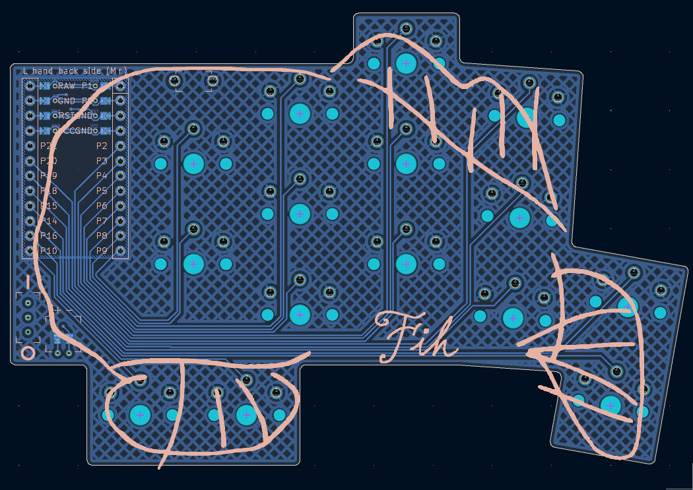

# Fih keeb
Fih keeb. 30 keys, very staggered, made using ergogen.

## BOM
| Name | Qt | Notes|
| :--- | :---: | :--- |
| Fih pcbs | 2 | gerbers [here](./pcb/gerbers) |
| nice!nanos or clones | 2 | i used [these](https://www.aliexpress.us/item/3256806824240477.html) |
| female headers | 48 | make sure you get the shortest ones, ph3.5. [ali](https://www.aliexpress.us/item/3256806227209544.html) |
| 301230 LiPos | 2 | any size that can fit under the n!n will work, i used [these](https://www.aliexpress.us/item/3256809270469725.html) |
| JST PH 2.0 connectors | 2 | [ali](https://www.aliexpress.us/item/3256804769340392.html) |
| choc v1 or v2 switches and keycaps | 30 | duh |
| SS12D00 power switches | 2 | make sure you get the DIP version. [ali](https://www.aliexpress.us/item/3256810241242670.html) |
| TS-1136-4.3 reset buttons | 2 | [ali](https://www.aliexpress.us/item/3256801442870232.html) |
| rubber feet | 8 | [ali](https://www.aliexpress.us/item/3256805129083590.html) |
> note: solder the jumpers on the BACK of the pcb relative to your parts. the n!n silkscreen has a reminder.

## firmware
[here](https://github.com/tangyboi3/zmk-keyboard-fih/)

## thanks
thanks to mrzealot for [ergogen](https://ergogen.ceoloide.com/), ceoloide for their fork and [footprints](https://github.com/ceoloide/ergogen-footprints/), genteure for the neat [zmk shield wizard](https://shield-wizard.genteure.com/), [zmk](https://v0-3-branch.zmk.dev/) itself for the firmware, the [hummingbird](https://github.com/PJE66/hummingbird), [berylline](https://github.com/jcmkk3/trochilidae#berylline), and [pueo](https://github.com/grassfedreeve/pueo/) keyboards for inspiration, and @car_kaboomer on discord for all the help.

## todo
get pictures

maybe make a case
